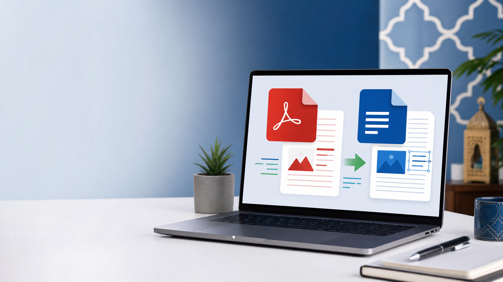
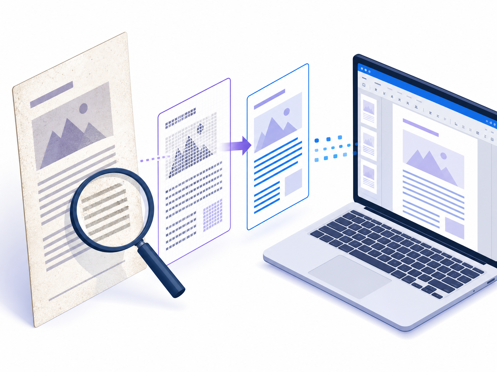

# أحسن الطرق باش تحول PDF لـWord بلا فلوس

**Meta title:** أحسن الطرق لتحويل PDF إلى Word بلا فلوس  
**Meta description:** تعلم كيفاش تحول PDF إلى Word مجاناً باستعمال Adobe وGoogle Docs وWord وأدوات OCR، مع مقارنة، خطوات عملية ونصائح الخصوصية.  
**Slug مقترح:** `tahwil-pdf-word-gratuit`  
**الكلمة المفتاحية الرئيسية:** تحويل PDF إلى Word مجاناً  
**كلمات مفتاحية ثانوية:** PDF إلى Word بلا فلوس، تحويل PDF إلى DOCX، تحويل PDF سكانير إلى Word، OCR مجاني، تعديل PDF، أفضل محول PDF.

*صورة أصلية مولدة للمقال. النص البديل: حاسوب يعرض عملية تحويل ملف PDF إلى مستند Word قابل للتحرير.*

واش عندك عقد، درس، فورمولاير أو وثيقة PDF وبغيتي تبدل فيها شي حاجة؟ أسهل حل هو تحويلها إلى **Word قابل للتعديل**. الخبر الزوين هو أنك ما محتاجش تشري برنامج غالي: كاينين طرق مجانية كتخدم مباشرة من المتصفح، وطرق أخرى باستعمال Google Docs أو Microsoft Word إذا كان متوفر عندك.

ولكن قبل ما تختار الأداة، خاصك تعرف الفرق بين جوج أنواع ديال PDF:

- **PDF نصي:** تقدر تحدد الكلام بالماوس وتنسخو. هاد النوع كيتحول غالباً بنتيجة مزيانة.
- **PDF سكانير أو صورة:** الصفحة عبارة عن صورة، وما تقدرش تحدد النص. هنا خاصك تقنية OCR، يعني التعرف الضوئي على الحروف، باش يتحول الكلام إلى نص قابل للتعديل.

## الخلاصة السريعة

| الطريقة | مناسبة لـ | المميزات | أهم الحدود |
|---|---|---|---|
| Adobe Acrobat Online | تحويل سريع من المتصفح | مجاني، PDF إلى DOCX، يدعم OCR فالحالات المناسبة | حدود يومية، والـlayout المعقد قد يحتاج تصحيح |
| Google Drive وGoogle Docs | وثائق بسيطة أو نصية | ما تحتاجش تثبيت برنامج | الجداول والصور والتنسيق قد يتبدلو |
| Microsoft Word للويب/سطح المكتب | اللي عندو Word | فتح PDF وتعديله مباشرة | النتيجة كتختلف حسب نسخة Word وتعقيد الملف |
| iLovePDF | تحويل سريع مع أدوات PDF إضافية | واجهة سهلة وPDF إلى Word | راجع سياسة الخصوصية قبل رفع وثائق حساسة |
| Smallpdf أو Xodo | بديل online وOCR | عملي للوثائق المصورة حسب الأداة | بعض الميزات أو الاستعمالات عندها حدود |
| LibreOffice Draw | تحويل محلي بلا رفع الملف | الخصوصية أحسن حيث الملف كيبقى فالجهاز | التنسيق المعقد ماشي دائماً مثالي |

## 1. Adobe Acrobat Online: أسهل اختيار للتحويل السريع

[Adobe Acrobat Online PDF to Word](https://www.adobe.com/acrobat/online/pdf-to-word.html) غالباً هو أول اختيار ملي بغيتي تحول PDF إلى Word بلا تثبيت برنامج. حسب الصفحة الرسمية، كتضغط على **Select a file** أو كتجر الملف للمنطقة المخصصة، ومن بعد Acrobat كيحوّلو تلقائياً إلى ملف Word قابل للتعديل.[1]

### الخطوات

1. دخل إلى أداة [Adobe PDF to Word](https://www.adobe.com/acrobat/online/pdf-to-word.html).
2. ضغط على **Select a file**.
3. اختار ملف PDF من الهاتف أو الحاسوب.
4. تسنى حتى يكمل التحويل.
5. حمّل ملف DOCX.
6. افتحو فـWord أو Google Docs وراجع التنسيق.

Adobe كتذكر أن الأداة مجانية بلا اشتراك أو بطاقة بنكية، ولكن كاينين **حدود يومية**، بينما التحويلات غير المحدودة والمعالجة الجماعية مرتبطة بالخطة المدفوعة.[1]

### واش كيخدم مع PDF سكانير؟

نعم، Acrobat عندو OCR للتعرف على النص فملفات PDF المصورة. ولكن النتيجة كتعلق بجودة السكانير، وضوح الخط، اللغة، الجداول والكتابة اليدوية. راجع النص كامل قبل ما تستعمل الوثيقة رسمياً.

## 2. Google Drive وGoogle Docs: طريقة مجانية بلا برنامج إضافي

إلى عندك حساب Google، تقدر تجرب هاد الطريقة:

1. دخل إلى [Google Drive](https://drive.google.com/).
2. حمّل ملف PDF.
3. كليك يمين على الملف.
4. اختار **Open with > Google Docs**.
5. Google Docs غادي يحاول يستخرج النص.
6. من بعد اختار **File > Download > Microsoft Word (.docx)**.

هاد الطريقة عملية مع PDF النصي اللي فيه فقرات عادية. ولكن الجداول، الأعمدة، الصور، الحواشي والتنسيق المعقد ممكن يتبدلو. استعملها للنسخ الأولي، ثم نظم الملف يدوياً.

**نصيحة:** إذا كانت الوثيقة فيها معلومات شخصية أو سرية، ما ترفعهاش إلى أي خدمة cloud إلا إذا كان مسموح لك بذلك وفهمت إعدادات الحساب والخصوصية.

## 3. Microsoft Word: فتح PDF وتعديلو مباشرة

بعض نسخ Microsoft Word كتسمح لك تفتح PDF، وWord كيحاول يحولو إلى مستند قابل للتعديل. الطريقة العامة هي:

1. فتح Word.
2. اختار **Open**.
3. حدد ملف PDF.
4. وافق على الرسالة اللي كتقول إن Word غادي يحول نسخة من PDF.
5. راجع الصفحات والتنسيق.
6. اختار **Save As** وحفظ الملف بصيغة DOCX.

هاد الحل مفيد إذا كان Word مثبت عندك أو عندك الولوج إلى Word للويب. النتيجة كتكون أحسن مع PDF فيه نص عادي، وأقل دقة مع الأعمدة، الصور، النماذج والتصميمات المعقدة. إذا فشل Word فقراءة PDF سكانير، خاصك OCR قبل أو بدل الطريقة.

## 4. iLovePDF: خيار سريع مع أدوات أخرى

[iLovePDF PDF to Word](https://www.ilovepdf.com/pdf_to_word) كيوفر تحويل PDF إلى Word من المتصفح، وكيجمع معاه أدوات أخرى بحال ضغط PDF، الدمج، التقسيم والتحويل من Word إلى PDF.[2]

### كيفاش تستعملو؟

1. دخل إلى أداة PDF to Word.
2. حمّل الملف أو جرّو للصفحة.
3. ضغط على زر التحويل.
4. حمّل ملف Word.
5. فتح الملف وراجع النص والجداول والصور.

الميزة ديالو هي السرعة وسهولة الاستعمال. ولكن حيت الملف كيرفع إلى خدمة online، تجنب استعماله مع عقود سرية، وثائق هوية، معلومات صحية أو بيانات الزبناء إلا إذا كنت متأكد من سياسة الخدمة وصلاحياتك.

## 5. Smallpdf وXodo: بدائل مفيدة للوثائق العادية والسكانير

[Smallpdf PDF to Word](https://smallpdf.com/pdf-to-word) و[Xodo PDF to Word](https://xodo.com/pdf-to-word-converter) هما بدائل معروفة للتحويل من المتصفح. Xodo كيشير إلى استعمال OCR فتحويل PDF سكانير إلى Word، بينما Smallpdf عندو كذلك أداة OCR منفصلة للملفات اللي ما فيهاش نص قابل للتحديد.[3] [4]

قبل ما تختار أي أداة، دير اختبار بصفحة وحدة أو نسخة غير حساسة. قارن:

- واش الفقرات خرجات بنفس الترتيب؟
- واش العربية والفرنسية تقرات مزيان؟
- واش الجداول بقات مفهومة؟
- واش الصور حافظات على الجودة؟
- واش الملف Word قابل للتعديل فعلاً؟

ما تعتمدش على عبارة «100% accurate» فصفحة تسويقية. النتيجة كتختلف من ملف لآخر.

## 6. LibreOffice Draw: حل محلي كيركز على الخصوصية

إلى ما بغيتيش ترفع الملف للإنترنت، تقدر تجرب [LibreOffice](https://www.libreoffice.org/). افتح PDF باستعمال LibreOffice Draw، عدل النص والعناصر قدر الإمكان، ومن بعد صدّر أو انسخ المحتوى إلى Writer وحفظو بصيغة DOCX.

هاد الحل مناسب للوثائق اللي فيها خصوصية، حيث المعالجة كتكون محلياً فالجهاز. لكنه ماشي دائماً سريع، وPDF المعقد يقدر يفتح على شكل عناصر كثيرة ومتفرقة. استعمله ملي الخصوصية أهم من الحفاظ الكامل على التصميم.

*صورة أصلية للمقال. النص البديل: وثيقة سكانير تمر عبر OCR قبل تحويلها إلى مستند قابل للتعديل.*

## كيفاش تحول PDF سكانير إلى Word باستعمال OCR؟

إلى ما قدرتيش تحدد النص داخل PDF، فهذا غالباً ملف مصور. تبع هاد الخطوات:

1. اختار أداة عندها OCR، بحال Adobe Acrobat أو Xodo أو Smallpdf OCR.
2. حدد اللغة إذا الأداة كتسمح بذلك.
3. استعمل صورة واضحة ومستقيمة.
4. حول الملف إلى Word.
5. راجع الحروف المتشابهة، خصوصاً فالعربية والفرنسية والأرقام.
6. قارن كل فقرة بالصورة الأصلية.

OCR يقدر يخلط بين الحروف، مثلاً بين `0` و`O`، أو يسقط الحركات، أو يبدل اتجاه النص العربي. فالوثائق القانونية أو الإدارية، المراجعة اليدوية ماشي اختيارية.

## علاش كيتبدل التنسيق من PDF إلى Word؟

PDF مصمم باش يحافظ على شكل الصفحة، ماشي باش يخزن بالضرورة بنية سهلة للتحرير. أثناء التحويل، الأداة كتخمن فين كاين النص، العناوين، الأعمدة والصور. لهذا ممكن توقع هاد المشاكل:

- الأعمدة كتولي فقرات متداخلة.
- الجداول كتخرج على شكل نص عادي.
- الصور كتتحرك من مكانها.
- الخطوط غير المتوفرة كتتبدل.
- الصفحات بالعربية كتحتاج تصحيح الاتجاه والمحاذاة.
- التوقيعات والخط اليدوي ما كيتحولوش إلى نص موثوق.

من بعد التحويل، استعمل **Ctrl+A** وغير الخط، ثم راجع العناوين، المسافات، page breaks والجداول. إذا كان الهدف غير استخراج النص، ما تضيعش الوقت فإعادة بناء التصميم كامل.

## شنو هي أحسن طريقة حسب الحالة؟

| الحالة | الطريقة المقترحة |
|---|---|
| PDF بسيط فيه نص | Adobe أو Google Docs |
| PDF سكانير واضح | Adobe OCR أو Xodo/Smallpdf OCR |
| وثيقة سرية | LibreOffice أو برنامج محلي موثوق |
| جدول معقد | Word أو Adobe، مع مراجعة يدوية |
| تحويل سريع من الهاتف | Adobe أو iLovePDF |
| ما عندكش Word | Google Docs ثم Download as DOCX |
| باغي تحافظ على الشكل الأصلي | Adobe غالباً أفضل، لكن راجع النتيجة |

## نصائح للخصوصية قبل رفع PDF

**ما ترفعش وثيقة حساسة بلا سبب.** عقود العمل، CIN، كشوفات الحساب، الملفات الطبية وبيانات الزبناء خاصها حذر كبير.

**استعمل نسخة من الملف.** حذف المعلومات غير الضرورية قبل التحويل يقلل المخاطر.

**راجع سياسة الخصوصية وشروط الاستخدام.** شوف كيفاش كتتعالج الملفات، واش كيتحذفو من بعد، وواش كاين حساب أو تخزين سحابي.

**حمل الملف من الموقع الرسمي.** تجنب البرامج المقرصنة والإعلانات اللي كتطلب تثبيت ملفات مجهولة.

**مسح الملفات من الخدمة من بعد.** إذا المنصة كتسمح بالحذف، استعمل الخيار. ومن جهازك، نظف مجلد Downloads إذا كانت الوثيقة حساسة.

## الخلاصة

إلى بغيتي **تحول PDF إلى Word بلا فلوس** وبسرعة، بدا بـAdobe Acrobat Online. إلى عندك Google Drive، Google Docs حل سهل للملفات النصية. Word مفيد إذا كان متوفر عندك، وiLovePDF وSmallpdf وXodo كيعطيو بدائل عملية. أما PDF السكانير، فخاصك OCR ومراجعة دقيقة.

اختار الأداة حسب نوع الملف والخصوصية ديالو، ماشي غير حسب السرعة. وبعد كل تحويل، فتح Word وراجع النص، الجداول، الصور، اللغة العربية والأرقام قبل ما ترسل الوثيقة أو تعتمد عليها.

## روابط داخلية مقترحة لموقعك

بدل هاد المسارات بروابط مقالات حقيقية من موقعك:

- [كيفاش تحول Word إلى PDF مجاناً](/تحويل-word-الى-pdf)
- [أفضل مواقع ضغط PDF بلا فلوس](/ضغط-pdf-مجانا)
- [كيفاش توقع وثيقة PDF إلكترونياً](/توقيع-pdf-إلكترونيا)
- [طرق حماية وثائقك على الإنترنت](/حماية-الوثائق-على-الانترنت)

## References

[1]: https://www.adobe.com/acrobat/online/pdf-to-word.html "Adobe Acrobat: Convert PDF to Word"
[2]: https://www.ilovepdf.com/pdf_to_word "iLovePDF: Convert PDF to Word online"
[3]: https://smallpdf.com/pdf-to-word "Smallpdf: Free PDF to Word Converter"
[4]: https://xodo.com/pdf-to-word-converter "Xodo: PDF to Word Converter with OCR"
[5]: https://support.microsoft.com/en-us/office/edit-a-pdf-6d3d3b6e-6b3c-4e3d-8a3e-4a9b6c1f9e1d "Microsoft Support: Edit a PDF in Word"
[6]: https://www.libreoffice.org/discover/draw/ "LibreOffice Draw"

**آخر مراجعة:** 8 شتنبر 2026. راجع شروط الاستخدام والحدود قبل كل تحديث، حيث الأدوات المجانية والميزات يمكن تتبدل.  
**Author:** Manus AI

**ملاحظة للنشر:** حمّل الصورتين بجانب ملف Markdown، أو رفعهما إلى Media Library ديال الموقع وبدل المسارات النسبية بروابط الصور النهائية. ضغط الصور إلى WebP يقدر يحسن سرعة الصفحة، مع الحفاظ على النص البديل.
