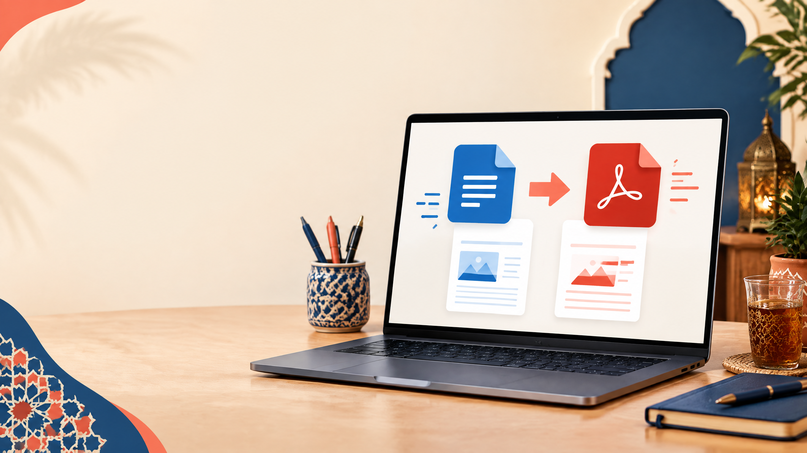

# كيفاش تحول Word لـPDF بلا فلوس؟

**Meta title:** تحويل Word إلى PDF مجاناً: أسهل الطرق بالدارجة  
**Meta description:** تعلم كيفاش تحول ملف Word إلى PDF مجاناً من Word وGoogle Docs وLibreOffice، مع نصائح باش يبقى الشكل والخصوصية محفوظين.  
**Slug مقترح:** `tahwil-word-pdf-gratuit`  
**الكلمة المفتاحية الرئيسية:** تحويل Word إلى PDF مجاناً  
**كلمات مفتاحية ثانوية:** Word إلى PDF بلا فلوس، DOCX إلى PDF، حفظ Word كـPDF، تحويل مستند إلى PDF

*صورة أصلية مولدة للمقال. النص البديل: حاسوب كيبين تحويل مستند Word إلى ملف PDF.*

من Word للويب حتى Google Docs وLibreOffice: هادي طرق عملية باش تخرج نسخة PDF مرتبة وقابلة للمشاركة، بلا ما تحتاج برنامج غالي.

## الخلاصة السريعة

الجواب المختصر: افتح الوثيقة، اختار File ثم Export أو Download، حدد PDF، ومن بعد فتح النسخة الجديدة وراجع الصفحات والروابط قبل الإرسال.

## علاش PDF هو الاختيار المناسب للمشاركة؟

ملف Word مناسب للتحرير، ولكن الشكل ديالو يقدر يتبدل ملي تفتحو فحاسوب أو هاتف مختلف. PDF كيثبت تقريباً الخطوط، الصور وترتيب الصفحات، وكيخلي الوثيقة أسهل للطباعة والإرسال. قبل ما تحول، دير نسخة نهائية وخلي ملف Word الأصلي محفوظ باش تقدر تعدل من بعد.

## مقارنة سريعة

| الطريقة | مناسبة لـ | الميزة الأساسية | انتبه لـ |
|---|---|---|---|
| Word للويب أو سطح المكتب | الناس اللي خدامين بـWord | تصدير مباشر مع الحفاظ على التصميم | راجع الخطوط والروابط |
| Google Docs | وثيقة كتخدم عليها online | مجانية وما كتحتاجش تثبيت | بعض الجداول أو الخطوط يقدرو يتبدلو |
| LibreOffice Writer | حل مجاني ومحلي | الملف كيبقى فالجهاز | النتيجة كتختلف مع الخطوط المعقدة |
| Print to PDF | أي برنامج تقريباً | خدام حتى بلا خيار Export | بعض الروابط والعناصر التفاعلية قد لا تنتقل |

## 1. التحويل من Word للويب

حسب [Microsoft Support](https://support.microsoft.com/en-us/word/export-word-document-as-pdf)، دخل للوثيقة، ضغط على **File** ثم **Export**، واختار **Download as PDF**. إذا كانت التعليقات مهمة، كاين اختيار منفصل باش تصدر PDF بالتعليقات. من بعد ضغط على **Download** وقلب على الملف فمجلد التنزيلات.[1]

قبل ما تصيفط الملف، فتح PDF وراجع: العناوين، ترقيم الصفحات، الصور، الروابط، اتجاه العربية، والصفحة الأخيرة. ما تفترضش أن التحويل دار كلشي مزيان غير حيث الملف تحل.

## 2. Google Docs: طريقة مجانية من المتصفح

إلى كانت الوثيقة فـGoogle Docs، مشي لـ**File > Download > PDF Document (.pdf)**. هاد الطريقة عملية للوثائق اللي فيها نص عادي، ولكن ممكن يتبدل شي عنصر إذا استعملتي خط ما متوفرش أو جدول معقد.

إلى عندك ملف `.docx`، رفعو لـGoogle Drive وفتحو بـGoogle Docs، راجع التنسيق، ومن بعد نزلو بصيغة PDF. ما ترفعش وثيقة حساسة لحساب cloud إلا كنت فاهم إعدادات المشاركة والصلاحيات ديالو.

## 3. LibreOffice: تحويل محلي بلا اشتراك

فـLibreOffice Writer، اختار **File > Export as PDF** أو زر PDF فالشريط. المساعدة الرسمية كتوضح أن Writer يقدر يصدر الوثيقة إلى PDF مع خيارات بحال الصفحات، الصور والروابط.[2] هاد الحل مناسب للناس اللي باغين يخدمو offline أو ما عندهمش Word.

العيب هو أن النتيجة ممكن تختلف إذا كانت الوثيقة مبنية على خط غير مثبت أو فيها عناصر خاصة بـMicrosoft Office. استعمل **File > Properties** وتأكد من author وmetadata إذا كانت الوثيقة مهنية أو فيها معلومات داخلية.

## 4. Print to PDF: حل سريع من أي جهاز

إلى ما لقيتيش Export، استعمل **Print** ثم اختار **Save as PDF** أو **Microsoft Print to PDF**. اختار حجم الورق، الاتجاه، الصفحات ونوع الجودة، ومن بعد حفظ الملف.

هاد الطريقة كتخرج نسخة جاهزة للطباعة، ولكن ممكن ما تحافظش على bookmarks أو بعض الروابط التفاعلية. جربها على نسخة قبل ما تعتمد عليها فـformulaire أو ملف فيه توقيع إلكتروني.

## كيفاش تحافظ على الجودة والحجم؟

إلى كان الملف فيه صور كثيرة، ما تستعملش أعلى جودة إلا كنت محتاجها للطباعة. للـemail والمشاركة العادية، جودة متوسطة غالباً كافية. إلى بقى الملف كبير، جرب مقال [كيفاش تضغط PDF بلا فلوس](article5.html) من بعد التحويل.

| الهدف | الاختيار العملي |
|---|---|
| إرسال CV أو تقرير بالإيميل | PDF عادي، مع صور مضغوطة بشكل معقول |
| طباعة احترافية | جودة عالية، وراجع حجم الورق والهوامش |
| وثيقة فيها روابط | استعمل Export بدل Print ثم اختبر الروابط |
| وثيقة حساسة | حولها محلياً، وحميها بكلمة مرور من بعد |

## Checklist قبل الإرسال

- افتح PDF فالهاتف والحاسوب.
- تأكد أن الاسم والتاريخ والصفحات صحيحين.
- جرب تحديد النص وفتح الروابط إذا كان الأمر مهماً.
- تأكد أن الصور ما تقطعوش وأن العربية باينة بالاتجاه الصحيح.
- سمي الملف باسم مفهوم، بحال `rapport-projet-2026.pdf`.
- ما تصيفطش Word الأصلي إذا كان المستلم محتاج غير نسخة للقراءة.

## الخلاصة

أسرع اختيار هو **Word > File > Export > PDF**. إذا ما عندكش Word، Google Docs وLibreOffice كيعطيو بدائل مجانية. أما Print to PDF فهو حل عام كيخدم تقريباً من أي برنامج. فكل الحالات، فتح النسخة النهائية وراجعها قبل المشاركة.

> PDF مزيان ماشي غير ملف تبدل الامتداد ديالو؛ هو نسخة نهائية خاصها تتراجع قبل ما تخرج من عندك.

## روابط داخلية مفيدة

- [أحسن الطرق باش تحول PDF لـWord بلا فلوس](article3.html)
- [كيفاش تصاوب CV احترافي مجاناً بـCanva](article2.html)
- [كيفاش تضغط PDF بلا فلوس](article5.html)

## References

[1]: https://support.microsoft.com/en-us/word/export-word-document-as-pdf "Microsoft Support: Export Word document as PDF"
[2]: https://help.libreoffice.org/latest/en-US/text/shared/01/ref_pdf_export.html "LibreOffice Help: Export as PDF"

**آخر مراجعة:** 11 شتنبر 2026. راجع الواجهات والخيارات الرسمية قبل الاستعمال حيث البرامج كتتبدل.

**Author:** Tqniya Bdarija
