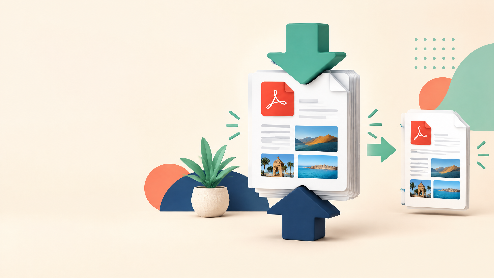

# كيفاش تضغط PDF بلا فلوس وبلا ما يهبط بزاف الجودة؟

**Meta title:** ضغط PDF مجاناً: نقص الحجم بلا ما تخسر الجودة  
**Meta description:** تعلم كيفاش تصغر حجم PDF للإيميل والرفع online باستعمال Adobe وPreview ونصائح عملية للصور، مع اختيار مستوى الضغط المناسب.  
**Slug مقترح:** `daght-pdf-gratuit`  
**الكلمة المفتاحية الرئيسية:** ضغط PDF مجاناً  
**كلمات مفتاحية ثانوية:** تصغير حجم PDF، ضغط PDF بلا فلوس، تقليل حجم ملف PDF، PDF للإيميل

*صورة أصلية مولدة للمقال. النص البديل: ملف PDF كبير كيتضغط لحجم أصغر.*

إلى كان PDF ثقيل على الإيميل أو formulaire، تقدر تصغرو بطرق مجانية. السر هو تختار مستوى الضغط حسب واش غادي تقراه فالشاشة ولا تطبعو.

## الخلاصة السريعة

الجواب المختصر: خدم على نسخة من الملف، استعمل ضغط متوسط أولاً، ومن بعد قارن الحجم والوضوح والروابط قبل ما تحذف النسخة الأصلية.

## علاش PDF كيولي ثقيل؟

أكبر سبب هو الصور عالية الدقة، خصوصاً فالسكانير والكتالوجات. الخطوط المدمجة، المرفقات، الطبقات والmetadata حتى هي كتزيد الحجم. الضغط كيحاول ينقص البيانات الزائدة أو دقة الصور، لذلك ما كايناش نتيجة وحدة مناسبة لكل الملفات.

## اختار الطريقة حسب الحالة

| الحالة | الاختيار المناسب | علاش |
|---|---|---|
| ملف عادي للإيميل | Adobe online بضغط متوسط | سريع ومن المتصفح |
| PDF فيه معلومات سرية | تطبيق desktop أو حل محلي | ما كترفعش الملف لخادم خارجي |
| ملف على Mac | Preview > Export > Reduce File Size | مدمج فالنظام |
| طباعة احترافية | ضغط خفيف أو إعداد print | باش ما تهبطش جودة الصور |
| سكانير قديم | ضغط متوسط ثم فحص بصري | باش يبقى النص مقروء |

## 1. Adobe Acrobat Online

[Adobe كتشرح](https://www.adobe.com/acrobat/online/compress-pdf.html) أنك كتضغط على **Select a file**، كتختار PDF، كتحدد مستوى الضغط، ومن بعد الأداة كتقلل الحجم وكتخليك تحمل النسخة الجديدة.[1]

خدم على نسخة، واختار **Medium** كبداية. الضغط القوي مناسب ملي الهدف هو الرفع السريع أو القراءة فالهاتف، ولكن الصور والنصوص الصغيرة يقدرو يهبطو فالوضوح. Adobe كتقول إن الأداة كتقدر تحيد بيانات غير مستعملة وتخفض دقة الصور حسب المستوى المختار.[1]

## 2. Preview فـMac

فـMac، فتح PDF فـPreview، اختار **File > Export**، ومن بعد فـ**Quartz Filter** اختار **Reduce File Size**، وحدد الاسم والمكان. هاد العملية سهلة، ولكن دير نسخة قبلها حيت الضغط القوي يقدر يعطي نتيجة أقل جودة.[2]

بعد التصدير، زوم على الصور والنص الصغير. إذا بان مغبش، عاود العملية بإعداد ألطف أو استعمل النسخة الأصلية للطباعة.

## 3. قبل الضغط: نقص الحجم من المصدر

النتيجة كتكون أحسن إذا صلحتي الملف قبل التصدير. صغر الصور الكبيرة قبل ما تدخلها للوثيقة، حيد الصفحات اللي ما محتاجهاش، وما تدمجش صور أصلية ضخمة بلا سبب. بالنسبة للسكانير، استعمل دقة مناسبة للقراءة بدل إعدادات الطباعة الاحترافية.

ما تعاودش ضغط نفس الملف مرات كثيرة. كل دورة تقدر تنقص الجودة، خصوصاً إذا كانت الصور JPEG.

## كيفاش تعرف واش النتيجة صالحة؟

قارن النسخة الأصلية والمضغوطة فخمسة أشياء: حجم الملف، وضوح النص، جودة الصور، الروابط، وفتح الملف فالهاتف. جرّب كذلك الطباعة إذا الوثيقة غادي تمشي للإدارة أو لزبون.

| الاختبار | النتيجة اللي خاصك |
|---|---|
| الحجم | نقص كافي باش يدوز فالإيميل أو formulaire |
| النص | قابل للقراءة والتحديد |
| الصور | ما فيهاش blur واضح |
| الروابط | كتفتح بشكل عادي |
| الصفحات | الترتيب والاتجاه باقيين صحيحين |

## واش نضغط PDF سري online؟

الملف السري ما خاصوش يطلع لأي خدمة online بلا سبب. العقود، CIN، الملفات الطبية، كشوفات الحساب وبيانات الزبناء خاصها حل محلي أو أداة موثوقة بسياسة واضحة. حتى إلا كانت الخدمة كتقول إنها كتحذف الملف من بعد، القرار خاصو يتوافق مع قواعد المؤسسة ديالك.

إلى بغيتي نصائح أكثر، قرا [كيفاش تحمي وثائق PDF والملفات الحساسة](article6.html). وإلى الهدف هو تغيير المحتوى، شوف [كيفاش تحول PDF لـWord](article3.html) قبل الضغط.

## الخلاصة

بدا بضغط متوسط، قارن النتيجة، وخلي الأصل محفوظ. Adobe مناسب للسرعة، Preview عملي فـMac، والحل المحلي أحسن للوثائق الحساسة. الضغط ماشي مسابقة فتصغير الحجم؛ المهم الملف يبقى مقروء ونافع.

> أحسن PDF مضغوط هو اللي نقص حجمو بلا ما يضيع المعنى أو الجودة اللي محتاجها.

## References

[1]: https://www.adobe.com/acrobat/online/compress-pdf.html "Adobe Acrobat: Compress a PDF"
[2]: https://support.apple.com/guide/preview/reduce-the-size-of-a-pdf-prvw1509/mac "Apple Support: Reduce the size of a PDF in Preview"

**آخر مراجعة:** 12 شتنبر 2026. الخيارات كتختلف حسب النظام والحساب وإصدار التطبيق.

**Author:** Tqniya Bdarija
