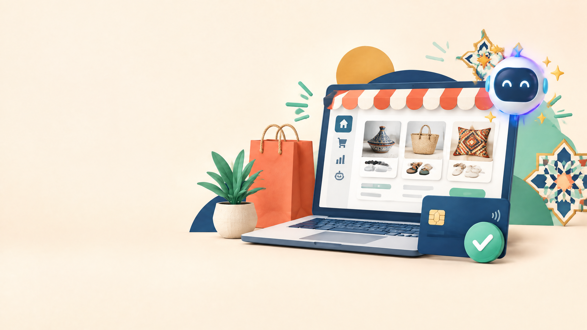

# كيفاش تبدا Ecommerce من المغرب وتستعمل AI باش تجيب Sales؟

**Meta title:** Ecommerce من المغرب: منصات البيع وStripe وPayPal وAI في 2026  
**Meta description:** دليل عملي بالدارجة باش تختار منصة البيع، تفتح PayPal أو Stripe بشكل قانوني، وتستعمل أحدث موديلات AI لتحسين المبيعات.  
**Slug مقترح:** `ecommerce-payments-ai-models-2026`  
**الكلمة المفتاحية الرئيسية:** التجارة الإلكترونية من المغرب  
**كلمات مفتاحية ثانوية:** Ecommerce Maroc، البيع أونلاين، PayPal المغرب، Stripe المغرب، منصات التجارة الإلكترونية، AI للمبيعات، زيادة conversion

*صورة أصلية مولدة للمقال. النص البديل: متجر إلكتروني مغربي مع وسيلة دفع آمنة ومساعد ذكاء اصطناعي.*

بغيتي تبيع منتوجات، services أو digital products online ولكن ما عارفش منين تبدا؟ المشكل ماشي غير ففتح site. خاصك تختار platform مناسبة، طريقة أداء كتخدم فبلادك، offer واضح، وworkflow ديال marketing تقدر تقيسو. فهاد الدليل غادي نعطيك route عملية من الفكرة حتى أول sales، ومعاها نظرة على أحدث موديلات AI اللي تقدر تعاونك فالمحتوى، البحث، customer support والتحليل.

## الجواب المختصر

إلى كنت مبتدئ: جرب **PayPal Business** أو payment links باش تختبر الطلب قبل ما تستثمر فـstore كبير. للمنتوجات الرقمية، Gumroad يقدر يختصر عليك checkout وpayout. للـcatalog والـbrand، Shopify سهل ولكن Shopify Payments ماشي متوفر فكل البلدان، لذلك خاصك provider آخر إذا كان البلد غير مدعوم. WooCommerce مناسب إلا بغيتي تحكم أكبر فالموقع والتكلفة، ولكن كيحتاج hosting وupdates. أما Stripe، ما تفتحش حساب ببلد أو عنوان غير حقيقي: المغرب ما بايناش فـStripe global supported countries وقت كتابة هاد المقال.[1]

## 1. اختار شنو غادي تبيع قبل اختيار المنصة

| نوع العرض | المنصة اللي تقدر تبدا بها | شنو تحتاج من الأول | المقياس المهم |
|---|---|---|---|
| منتوج مادي | Shopify أو WooCommerce | صور، ثمن، livraison، سياسة retour | conversion وcost per order |
| منتوج رقمي | Gumroad أو store بسيط | ملف، صفحة بيع، delivery تلقائي | sales وrefund rate |
| Service أو freelance | صفحة بسيطة + PayPal link/invoice | portfolio، offer، calendar | leads وclose rate |
| Test سريع | Landing page + payment link | offer واحد وCTA واضح | clicks إلى purchases |

ما تبداش بعشرين منتوج. اختار عرض واحد كيجاوب على مشكل واضح، صايب صفحة فيها النتيجة، لمن مناسب، الثمن، الأسئلة المتكررة، وطريقة التواصل. من بعد test بميزانية صغيرة أو organic content قبل ما تشري theme غالي أو plugins كثيرة.

## 2. Shopify ولا WooCommerce ولا Gumroad؟

### Shopify: أسرع طريق للـcatalog

Shopify مناسب للي بغا store منظم، theme، product management وintegrations بلا ما يتكلف بزاف بالتقنية. ولكن [Shopify كتوضح](https://help.shopify.com/en/manual/payments/shopify-payments/supported-countries) أن Shopify Payments خدام غير فالدول المدعومة، وإذا البلد أو النشاط ماشي فالقائمة خاصك **third-party payment provider**.[2] يعني Shopify platform ماشي هي نفسها payment gateway. قبل الاشتراك، شوف واش gateway اللي غادي تستعمل كيدعم بلدك، العملة، والـpayouts.

### WooCommerce: تحكم أكبر ولكن مسؤولية أكبر

WooCommerce مناسب إذا عندك WordPress وبغيتي تتحكم فالـcheckout، SEO، database وhosting. تقدر تختار payment gateway حسب البلد، ولكن خاصك تحدث WordPress وplugins، تحمي الموقع، وتدير backups. هاد الخيار مزيان للي مستعد يتعلم شوية technical basics أو يخدم مع developer.

### Gumroad: مناسب للـdigital products

Gumroad كيخليك تبيع ebooks، templates، courses أو files بلا ما تبني checkout من الصفر. صفحة المساعدة الرسمية كتقول إن Gumroad كيدعم bank payouts فالمغرب بالـMAD، وكيطلب معلومات التحقق بحال ID وصحة العنوان حسب الحالة.[3] ولكن payout rules، minimums وطرق السحب خاصها تتراجع داخل الحساب قبل الإطلاق، حيث كتقدر تتبدل. Gumroad حتى هو كيوضح أن طريقة أداء الزبون وطريقة payout ديالك جوج حوايج مختلفين.

## 3. كيفاش تفتح PayPal Business من المغرب؟

PayPal خيار عملي للاختبار، payment links، invoices وبعض المتاجر. صفحة PayPal Morocco كتذكر قبول PayPal وcredit/debit cards، وإنشاء invoice أو link أو QR code للمنتوج والخدمة.[4] صفحة PayPal للمطورين، المحدثة في 11 غشت 2026، كتصنف المغرب ضمن **Send, receive, and withdraw**.[5]

الخطوات العملية:

1. دخل للموقع الرسمي ديال PayPal وما تستعملش روابط من إعلانات مجهولة.
2. اختار Business إلا غادي تبيع بشكل مهني، وعمر الاسم، البلد، الإيميل وبيانات النشاط بصدق.
3. أكد الإيميل وربط وسيلة السحب المتاحة فالحساب ديالك. PayPal كتقول إن استقبال المال كيتطلب فتح الحساب وتأكيد الإيميل.[6]
4. كمل verification إذا طلبو ID، address أو business details.
5. بدا بـinvoice أو payment link واختبر عملية شراء صغيرة قبل ما تطلق campaign كبيرة.
6. راقب fees، conversion currency، chargebacks ووقت وصول الأموال من داخل dashboard.

مهم: availability ديال feature تقدر تختلف حسب السوق ونوع الحساب، لذلك ما تعتمدش على tutorial قديم. وما تستعملش عنوان أو بطاقة أو حساب بنكي ديال بلد آخر بطريقة كتخالف شروط PayPal؛ هاد الشي يقدر يسبب limitation أو hold.

## 4. وStripe؟

Stripe قوي بزاف للـcheckout، subscriptions، webhooks وintegration مع SaaS، ولكن فتح الحساب مربوط بالبلد اللي كيدعم Stripe وبالكيان القانوني والبنك والوثائق ديالو. [Stripe global](https://stripe.com/global) كيسرد الدول المدعومة، وMorocco ما بايناش فالقائمة وقت آخر مراجعة.[1]

إلى نتا فالمغرب، ما تديرش حساب Stripe ببيانات وهمية ولا تستعمل شركة أجنبية غير على الورق. الحل القانوني كيحتاج كيان حقيقي فبلد مدعوم، عنوان ووثائق وبنك متوافقين، أو تستعمل provider كيدعم المغرب مباشرة. Stripe Atlas خيار مختلف لأنه كيساعد فـincorporation فـUS، ولكن ماشي مجرد زر كيحول نشاط مغربي لحساب Stripe مغربي؛ راجع الشروط، الضرائب، accounting والالتزامات قبل أي قرار.[1]

**قاعدة ذهبية:** payment gateway ماشي غير account. خاص يكون عندك تطابق بين البلد، النشاط، identity، bank account، website وterms ديالك.

## 5. كيفاش تجيب Sales فعلاً؟

فتح store ما كيجبدش sales بوحدو. خدم بهاد funnel البسيط:

1. **Reach:** فيديو قصير، search content، email أو إعلان كيوصل للناس اللي عندهم المشكلة.
2. **Landing page:** عنوان كيشرح النتيجة، صور حقيقية، benefits، proof وCTA واحد.
3. **Trust:** contact واضح، سياسة retour، delivery time، privacy ووسيلة أداء معروفة.
4. **Checkout:** أقل عدد ممكن من الخطوات، mobile-first، وثمن واضح.
5. **Follow-up:** email أو message للناس اللي سولو وما شراوش، بلا spam.
6. **Measure:** سجل visits، add-to-cart، checkout وpurchases باش تعرف فين كيتحبس funnel.

ما تبدلش الثمن والdesign والad فـنفس النهار. بدل variable واحد، خليه يخدم مدة كافية، ومن بعد قارن الأرقام.

## 6. أحدث موديلات AI: شنو تبدل فالأداء؟

فـ2026، المقارنة بين AI models ولات خاصها تكون حسب المهمة، ماشي حسب لقب “الأفضل”. Stanford AI Index كيشير أن الموديلات العليا تقاربات فـArena، وأن benchmarks كتتشبع بسرعة وعندها مشاكل فالصلاحية وgaming.[7] لذلك الأرقام اللي كتعلنها الشركات كتكون مفيدة باش تفهم الاتجاه، ولكن ماشي ضمان أن model غادي يبيع أكثر ليك.

### GPT-6 Astra

حسب الإعلان الرسمي ديال OpenAI، GPT-6 Astra موجه للـcomputer use، browsing، software engineering، research وprofessional work. OpenAI كتعلن مثلاً على 64.6% فـTerminal-Bench Science 0.1 مقابل 52.6% لـClaude Fable 5.1 فالمقارنة المنشورة، و72.6% فـOSWorld 2.0 مقابل 65.7% لـGPT-5.6 Sol، مع اختلاف settings والتكلفة.[8]

بالنسبة لـecommerce، القيمة العملية هي: تحليل spreadsheet، research على competitors، كتابة product page، اختبار landing page، وربط model بأدوات عبر API. ما تخليهش يقرر refund أو يرسل عروض للناس بلا approval.

### Claude Opus 5

Anthropic كتقدم Claude Opus 5 كmodel قوي فالـcoding وknowledge work والمهام الطويلة. الشركة كتذكر أنه تفوق فـFrontier-Bench، وقريب من Fable 5 فـCursorBench 3.2 بنصف التكلفة لكل task فإعداد المقارنة، وحقق نتائج قوية فـOSWorld وZapier AutomationBench.[9] هاد النوع مناسب لبناء automation، تحليل customer feedback، وإعداد SOPs للفريق.

ولكن حتى الشركة كتفرق بين settings ديال effort والتكلفة. ما تقارنش نتيجة max effort مع جواب سريع من model آخر وكأنهم نفس الشي.

### كيفاش تختار model لمشروعك؟

| المهمة | الاختيار العملي | كيفاش تقيس الأداء |
|---|---|---|
| Product descriptions | model سريع ورخيص | نسبة النصوص اللي كتحتاج تصحيح |
| Customer support | model مع context وguardrails | resolution rate وescalation |
| Ads وhooks | جرب جوج models | CTR وconversion بعد test حقيقي |
| تحليل sales | model عندو tool/data access | دقة الحسابات ووقت التحليل |
| Coding وautomation | Opus 5 أو Astra حسب stack | bugs، وقت الإنجاز، وعدد iterations |

## 7. Prompts عملية

**Product page:**

> نتا copywriter ديال ecommerce. صايب صفحة بيع لمنتوج [المنتوج] للجمهور [الجمهور]. استعمل لغة [اللغة]، بين 5 فوائد حقيقية، ما تخترع حتى claim، زيد objection handling وCTA واحد. قبل ما تكتب، سولني على المعلومات الناقصة.

**تحليل funnel:**

> حلل هاد الجدول ديال visits وadd-to-cart وcheckout وsales. حسب conversion بين كل مرحلة، بين أكبر drop-off، واقترح 3 tests. ما تستنتجش سبباً ما كاينش عليه دليل، ووضح شنو خاصنا نجربو باش نتحققو.

**Customer support:**

> جاوب على الزبون بنبرة محترمة ومختصرة. استعمل غير policy اللي عطيتك. إذا الطلب فيه refund أو استثناء، ما توعدش بالنتيجة وصعّد الحالة لموظف.

## الخلاصة

أحسن route ماشي هي أنك تجمع 10 tools. اختار offer واحد، platform مناسبة، payment method متاح قانونياً فالمغرب، وfunnel قابل للقياس. PayPal يقدر يكون بداية عملية للـlinks وinvoices، Gumroad مناسب للـdigital products، Shopify سريع ولكن خاصك تتأكد من provider، وWooCommerce كيعطي تحكم أكبر. Stripe قوي، ولكن ما تفتحش حساب إلا كان البلد والكيان والوثائق ديالك مؤهلين فعلاً.

أما AI، استعمل GPT-6 Astra وClaude Opus 5 كأدوات إنتاجية حسب المهمة، ولكن خذ benchmark كإشارة ماشي كحقيقة نهائية. الـsales الحقيقية كتجي من offer واضح، trust، تجربة checkout مزيانة، واختبارات كتقيسها بالأرقام.

> AI يقدر يسرّع المتجر، ولكن ما يقدرش يعوض offer زوين وتجربة شراء موثوقة.

## روابط داخلية مفيدة

- [7 أدوات AI مجانية للقراية والخدمة](../../article-ai.html)
- [كيفاش تصاوب CV احترافي بـCanva](../../article2.html)
- [كيفاش تحمي وثائق PDF الحساسة](../../article6.html)

## References

[1]: https://stripe.com/global "Stripe: Global availability"
[2]: https://help.shopify.com/en/manual/payments/shopify-payments/supported-countries "Shopify Help Center: Supported countries for Shopify Payments"
[3]: https://gumroad.com/help/article/13-getting-paid "Gumroad Help Center: Getting paid"
[4]: https://www.paypal.com/ma/business/accept-payments?locale.x=fr_ST "PayPal Morocco: Accept payments"
[5]: https://developer.paypal.com/payouts/supported-features "PayPal Developer: Countries and supported features"
[6]: https://www.paypal.com/ma/cshelp/article/how-do-i-receive-money-through-paypal-help667?locale.x=en_MA "PayPal Help: How do I receive money?"
[7]: https://hai.stanford.edu/ai-index/2026-ai-index-report/technical-performance "Stanford AI Index 2026: Technical performance"
[8]: https://openai.com/index/gpt-6-astra/ "OpenAI: GPT-6 Astra"
[9]: https://www.anthropic.com/news/claude-opus-5 "Anthropic: Claude Opus 5"

**آخر مراجعة:** 13 شتنبر 2026. مميزات المنصات، الدول المدعومة، الشروط، الرسوم وأسماء الموديلات كتبدل؛ راجع المصادر الرسمية قبل فتح حساب أو إطلاق campaign.

**Author:** Tqniya Bdarija
